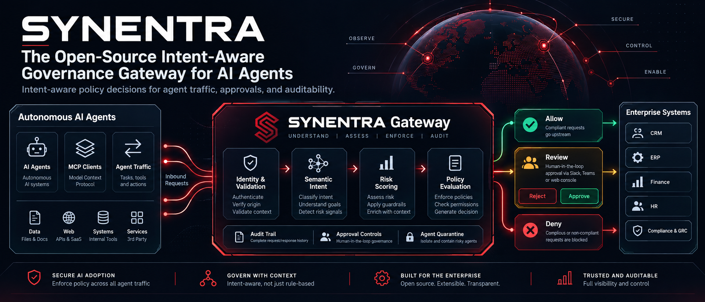

<div align="center">
  

  <h2>Intent-aware governance for AI agents acting on enterprise APIs</h2>

  <p>
    Synentra sits between autonomous AI agents and your HTTP APIs. It evaluates
    request context, classifies likely intent, applies policies and risk controls,
    and allows, blocks, or pauses high-risk actions for human approval.
  </p>

[![Build Status][actions-badge]][actions-url]
[![Quality Gate Status][sonarcloud-quality-gate-badge]][sonarcloud-quality-gate-url]
[![License: Apache 2.0][apache-badge]][apache-url]
[![FOSSA License Status][fossa-license-badge]][fossa-license-url]
[![Good First Issues][github-good-first-issue-badge]][github-good-first-issue-url]

**[Documentation](https://synentra.io/docs)** ·
**[Quick Start](#quick-start)** ·
**[Discord](https://discord.synentra.io)** ·
**[Discussions](https://github.com/synentra/synentra/discussions)**

</div>

---

## See Synentra in Action

<p align="center">
  
</p>

An AI agent sends a request:

```http
DELETE http://localhost:7080/proxy/https://localhost:8080/v1/customers?status=inactive
Synentra-Authorization: Bearer <agent-token>
Content-Type: application/json

{
  "instruction": "Clean up old customer accounts"
}
```

Synentra evaluates the request:

```text
Agent       : customer-maintenance-agent
Intent      : destructive_delete
Risk Score  : 0.91
Decision    : Human approval required
```

A traditional API gateway can authenticate the caller and match the HTTP method and path.

Synentra additionally evaluates the request context and likely intent before deciding whether the action should proceed.

## Quick Start

### Run with Docker

For start Synentra:

```bash
docker run --name synentra -p 7080:7080 ghcr.io/synentra/synentra:latest
```

Synentra will be available at:

```text
http://localhost:7080
```

> Production deployments require an appropriate security configuration, including token issuance and secret management. See the [Security configuration documentation](https://synentra.io/docs/configuration/security) before deploying Synentra in production.

To provide your own configuration file:

```bash
docker run \
  --name synentra \
  -p 7080:7080 \
  -v "$(pwd)/appsettings.json:/app/appsettings.json:ro" \
  ghcr.io/synentra/synentra:latest
```

For a complete Docker setup, see the
[Synentra Docker Deployment](https://synentra.io/docs/operations/deployment/docker)
documentation.

### Use a Pre-Built Binary

Pre-built binaries for supported platforms are available on the
[Releases](https://github.com/synentra/synentra/releases) page.

Download and extract the appropriate archive for your platform.

On Linux:

```bash
tar -xzf synentra-linux-x64.tar.gz
chmod +x synentra
./synentra
```

On Windows:

```powershell
.\synentra.exe
```

### Build from Source

**Prerequisite:** [.NET 10 SDK](https://dotnet.microsoft.com/en-us/download/dotnet/10.0)

```bash
git clone https://github.com/synentra/synentra.git
cd synentra

dotnet restore
dotnet build --configuration Release
dotnet test --configuration Release

dotnet run --project src/Synentra --configuration Release
```

## Why Synentra?

AI agents can make authenticated and technically valid API requests while still taking actions that are unintended, excessive, or dangerous.

Traditional gateways primarily answer questions such as:

* Is the caller authenticated?
* Is the caller authorized to access this route?
* Is the request within its rate limit?

Synentra adds another governance layer:

* What is the agent likely trying to accomplish?
* How risky is this action in the current context?
* Does the request comply with behavioral and semantic policies?
* Should this action require human approval?
* Has the agent's previous behavior reduced its trust level?

| Without Synentra                                              | With Synentra                                                                                     |
| ------------------------------------------------------------- | ------------------------------------------------------------------------------------------------- |
| Decisions are primarily based on identity, route, and method. | Decisions can also consider likely intent, risk, trust, and historical behavior.                  |
| An authorized destructive request may execute immediately.    | High-risk actions can be blocked or suspended for human approval.                                 |
| Agent behavior must be correlated across separate systems.    | Agent identity, classifications, policy decisions, and review outcomes are recorded together.     |
| Semantic controls often require custom integrations.          | Semantic analysis, risk scoring, policy enforcement, and HITL are coordinated inside the gateway. |

## Core Capabilities

### Semantic Intent Classification

Synentra evaluates request context such as the HTTP method, path, payload, agent identity, and configured policy state. 
Local inference keeps request data inside your environment and avoids requiring an external classification API.

### Policy Enforcement

Synentra combines deterministic policy rules with semantic conditions.

Policies can evaluate:

* Agent identity and attributes
* HTTP method and path
* Request headers and payload
* Classified intent
* Confidence level
* Risk score
* Historical behavior

Policies can return one of three primary outcomes:

```text
Allow
Deny
HITL (Require human approval)
```

### Risk and Trust Scoring

Synentra evaluates contextual risk signals for each request.

These signals can include:

* HTTP method
* Target path
* Request body characteristics
* Time-based conditions
* Agent history
* Anomaly signals
* Previous policy violations
* Previous HITL decisions

Agent trust can evolve over time based on observed behavior. Agents that fall below a configured trust threshold can be quarantined until manually reviewed.

### Human-in-the-Loop

High-risk or ambiguous requests can be suspended before they reach the upstream API.

A reviewer can:

* Inspect the request and decision context
* Approve the action
* Deny the action
* Record the reason for the decision

Synentra can notify reviewers through:

* Slack
* Microsoft Teams
* PagerDuty
* Generic webhooks

### Agent Identity and Auditability

Synentra associates requests and decisions with registered agent identities.

Audit records can include:

* Agent identity
* Request metadata
* Classified intent
* Classification confidence
* Risk score
* Policy result
* HITL status
* Reviewer decision
* Final routing outcome

### Observability

Synentra supports structured logging and distributed observability for governance decisions and request processing.

Supported capabilities include:

* Structured application logs
* File and console logging
* OpenTelemetry export
* Audit records
* Health endpoints
* Decision and latency telemetry

## Architecture


Each inbound request passes through the Synentra governance pipeline.

### 1. Request Validation

Synentra first validates the request and its caller.

This stage can include:

* API version validation
* Agent authentication
* JWT validation
* Rate limiting
* Request-size limits

Requests that fail validation are blocked and recorded.

### 2. Decision Engine

Valid requests are evaluated through the governance pipeline.

#### Policy Evaluation

Configured policies evaluate the agent, request, environment, and available semantic context.

A policy can immediately allow, deny, or require human approval.

#### Risk Scoring

Risk calculators evaluate contextual signals such as the HTTP method, target path, payload characteristics, request timing, agent history, and anomaly indicators.

#### Semantic Analysis

The semantic provider classifies the likely intent of the request and returns a confidence score.

The resulting intent can be used by policies and the final decision process.

### 3. Routing Outcome

The request receives one of the following outcomes:

* ✅ **Allow** — the request is forwarded to the upstream service.
* ⏳ **Pending review** — the request is suspended until a reviewer approves or denies it.
* 🚫 **Block** — the request is rejected before reaching the upstream service.

Each outcome is recorded for auditing and observability.

## Key Features

* **Intent-aware request evaluation** using local semantic classification
* **Deterministic and semantic policies** for context-aware enforcement
* **Risk scoring** using configurable request and behavioral signals
* **Dynamic agent trust** based on historical behavior
* **Human-in-the-loop workflows** for sensitive actions
* **Multi-channel HITL notifications**
* **Agent quarantine** for identities that fall below a trust threshold
* **Per-agent audit trails**
* **Structured logging and OpenTelemetry support**
* **Memory and Redis caching**
* **SQLite and PostgreSQL storage options**
* **External identity provider integration**
* **Local operation without a required cloud classification service**

## What Synentra Is Not

Synentra is not intended to replace every component in an AI or API platform.

It is not:

* A general-purpose LLM proxy
* A token accounting or prompt-caching platform
* An OpenAI API cost-management service
* A load balancer
* A canary deployment system
* A replacement for your identity provider
* Limited to MCP servers or a specific agent framework

Synentra governs AI-agent actions against HTTP APIs and can be used with LangChain, Semantic Kernel, custom agents, MCP-based systems, and other frameworks.

## Who Is Synentra For?

### Platform Engineers

Add a centralized governance layer between AI agents and internal APIs without implementing separate controls in every service.

### Security Architects

Apply policies using agent identity, request context, likely intent, risk, and historical behavior.

### AI Agent Developers

Integrate agents with one governance gateway instead of building policy enforcement, risk evaluation, audit logging, and approval workflows independently.

### Governance and Compliance Teams

Use policy decisions, human approvals, and audit records as technical controls that can support broader organizational governance and compliance programs.

> Synentra provides technical governance controls. Using Synentra alone does not establish compliance with standards or regulations such as SOC 2 or HIPAA.

## Performance

Synentra is designed for low-latency, local request evaluation.

Performance depends on factors including:

* Hardware
* Model configuration
* Payload size
* Enabled policies
* Storage provider
* Cache provider
* Logging configuration
* Semantic provider

Published performance results should be interpreted together with their test environment and benchmark methodology.

See the documentation for current performance measurements and configuration guidance:

**[Performance documentation](https://synentra.io/docs)**

## Roadmap

The project roadmap describes planned capabilities, upcoming releases, and longer-term direction.

👉 [View the Synentra roadmap](ROADMAP.md)

## Documentation

Full documentation is available at:

**https://synentra.io/docs**

Useful starting points:

* [Getting Started](https://synentra.io/docs/getting-started)
* [System Configuration](https://synentra.io/docs/configuration/system)
* [Security Configuration](https://synentra.io/docs/configuration/security)
* [Semantic Configuration](https://synentra.io/docs/configuration/semantic)
* [Policy Configuration](https://synentra.io/docs/configuration/policy)
* [HITL Configuration](https://synentra.io/docs/configuration/hitl)
* [Observability](https://synentra.io/docs/configuration/observability)

## Security

Security is a core concern for Synentra. The project follows a responsible disclosure process for reported vulnerabilities.

### Reporting a Vulnerability

**Do not report security vulnerabilities through a public GitHub issue.**

Use one of the following private channels:

* **GitHub Private Vulnerability Reporting:**
  [Report a vulnerability](https://github.com/synentra/synentra/security/advisories/new)

* **Email:**
  [security@synentra.io](mailto:security@synentra.io)
  Subject: `[Synentra] Security Vulnerability`

Include, where possible:

* A description of the vulnerability
* Its potential impact
* Steps to reproduce
* A proof of concept
* Relevant environment information
* The affected Synentra version

We aim to acknowledge security reports within 48 hours and provide an initial remediation timeline within several days.

### Security Policy

Supported versions and the complete disclosure process are documented in:

**[SECURITY.md](SECURITY.md)**

### Dependency and Code Analysis

Synentra uses:

* [FOSSA](https://fossa.com) for dependency license and vulnerability analysis
* [SonarCloud](https://sonarcloud.io) for static analysis, reliability, maintainability, and security checks

Additional project-health badges are available in the [Project Health](#project-health) section.

## Community and Contributing

Synentra is developed in the open. Contributions may include code, tests, documentation, integrations, issue reports, feature proposals, and design discussions.

### Ways to Participate

* 🐛 [Report a bug](https://github.com/synentra/synentra/issues/new?template=bug_report.md)
* 💡 [Request a feature](https://github.com/synentra/synentra/issues/new?template=feature_request.md)
* 🔍 [Browse good first issues](https://github.com/synentra/synentra/issues?q=is%3Aissue+is%3Aopen+label%3A%22good+first+issue%22)
* 📖 Improve the documentation
* 🧪 Add tests and examples
* 🔌 Propose or implement integrations
* 💬 Join project discussions

### Contributing Code

1. Fork the repository.
2. Create a branch from `main`.
3. Implement the change.
4. Add or update tests.
5. Run the test suite:

```bash
dotnet test --configuration Release
```

6. Open a pull request against `main` with a clear explanation of the change.

Read [CONTRIBUTING.md](CONTRIBUTING.md) before submitting a pull request.

### Community Channels

* **Discord:** https://discord.synentra.io
* **GitHub Discussions:** https://github.com/synentra/synentra/discussions
* **Documentation:** https://synentra.io/docs

### Discussion Categories

| Category      | Purpose                                 |
| ------------- | --------------------------------------- |
| Q&A           | Ask questions and receive help          |
| Ideas         | Propose features and improvements       |
| Contributors  | Coordinate contribution work            |
| Governance    | Discuss project direction and decisions |
| Show and Tell | Share integrations and projects         |
| Announcements | Follow releases and project updates     |

## Project Health

[![.NET][dotnet-budge]][dotnet-url]
[![Build Status][actions-badge]][actions-url]
[![Quality Gate Status][sonarcloud-quality-gate-badge]][sonarcloud-quality-gate-url]
[![Reliability Gate Status][sonarcloud-reliability-gate-badge]][sonarcloud-reliability-gate-url]
[![Maintainability Gate Status][sonarcloud-maintainability-gate-badge]][sonarcloud-maintainability-gate-url]
[![Security Gate Status][sonarcloud-security-gate-badge]][sonarcloud-security-gate-url]
[![Vulnerabilities Gate Status][sonarcloud-vulnerabilities-gate-badge]][sonarcloud-vulnerabilities-gate-url]
[![FOSSA License Status][fossa-license-badge]][fossa-license-url]
[![FOSSA Security Status][fossa-security-badge]][fossa-security-url]

## Governance

Project governance and maintainer responsibilities are documented in:

* [GOVERNANCE.md](GOVERNANCE.md)
* [MAINTAINERS.md](MAINTAINERS.md)
* [CODE_OF_CONDUCT.md](CODE_OF_CONDUCT.md)
* [ROADMAP.md](ROADMAP.md)

## License

Synentra is open source and licensed under the
[Apache License 2.0](LICENSE).

Some dependencies use other open-source licenses. Their notices and attribution requirements are documented in:

**[THIRD-PARTY-NOTICES.md](THIRD-PARTY-NOTICES.md)**

## Support Synentra

If Synentra solves a problem for your team, consider starring the repository. It helps other developers discover the project and follow its development.

[](https://github.com/synentra/synentra)

## Contributors

Thanks to all the contributors who help make Synentra better! ❤️

<a href="https://github.com/synentra/synentra/graphs/contributors">
  
</a>


[dotnet-budge]: https://img.shields.io/badge/.NET-10.0-purple
[dotnet-url]: https://dotnet.microsoft.com/en-us/download/dotnet/10.0
[apache-badge]: https://img.shields.io/badge/License-Apache%202.0-blue.svg?style=flat&logo=github
[apache-url]: https://opensource.org/licenses/Apache-2.0
[actions-badge]: https://github.com/synentra/synentra/actions/workflows/build.yml/badge.svg?branch=main
[actions-url]: https://github.com/synentra/synentra/actions?workflow=build
[github-good-first-issue-badge]: https://img.shields.io/github/issues/synentra/synentra/good%20first%20issue?style=flat-square&logo=github&label=good%20first+issues
[github-good-first-issue-url]: https://github.com/synentra/synentra/issues?q=is%3Aissue+is%3Aopen+label%3A%22good+first+issue%22
[sonarcloud-quality-gate-badge]: https://sonarcloud.io/api/project_badges/measure?project=synentra_synentra&metric=alert_status&token=0b5b5ca3c5f12401df0abb73c369c8a620fc174a
[sonarcloud-quality-gate-url]: https://sonarcloud.io/summary/new_code?id=synentra_synentra
[sonarcloud-reliability-gate-badge]: https://sonarcloud.io/api/project_badges/measure?project=synentra_synentra&metric=reliability_rating&token=0b5b5ca3c5f12401df0abb73c369c8a620fc174a
[sonarcloud-reliability-gate-url]: https://sonarcloud.io/summary/new_code?id=synentra_synentra
[sonarcloud-maintainability-gate-badge]: https://sonarcloud.io/api/project_badges/measure?project=synentra_synentra&metric=sqale_rating&token=0b5b5ca3c5f12401df0abb73c369c8a620fc174a
[sonarcloud-maintainability-gate-url]: https://sonarcloud.io/summary/new_code?id=synentra_synentra
[sonarcloud-security-gate-badge]: https://sonarcloud.io/api/project_badges/measure?project=synentra_synentra&metric=security_rating&token=0b5b5ca3c5f12401df0abb73c369c8a620fc174a
[sonarcloud-security-gate-url]: https://sonarcloud.io/summary/new_code?id=synentra_synentra
[sonarcloud-vulnerabilities-gate-badge]: https://sonarcloud.io/api/project_badges/measure?project=synentra_synentra&metric=vulnerabilities&token=0b5b5ca3c5f12401df0abb73c369c8a620fc174a
[sonarcloud-vulnerabilities-gate-url]: https://sonarcloud.io/summary/new_code?id=synentra_synentra
[fossa-license-badge]: https://app.fossa.com/api/projects/git%2Bgithub.com%2Fsynentra%2Fsynentra.svg?type=shield&issueType=license
[fossa-license-url]: https://app.fossa.com/projects/git%2Bgithub.com%2Fsynentra%2Fsynentra?ref=badge_shield&issueType=license
[fossa-security-badge]: https://app.fossa.com/api/projects/git%2Bgithub.com%2Fsynentra%2Fsynentra.svg?type=shield&issueType=security
[fossa-security-url]: https://app.fossa.com/projects/git%2Bgithub.com%2Fsynentra%2Fsynentra?ref=badge_shield&issueType=security
